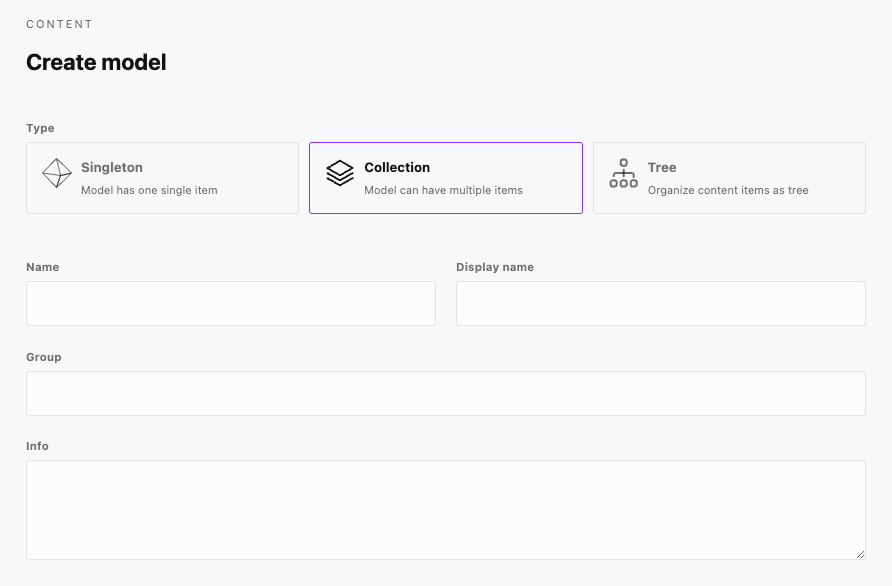

# Content

[[toc]]

## Introduction

With this version of Cockpit content is organized in so-called content models. You can create a content model for a collection of items or just one single item - type and structure specified when creating the content model.

A content model consists of the fields you define, with each field belonging to one of Cockpit's [Field types](/concepts/field-types). Depending on the fields configured you can than create items containing the required data.

## Collection

### The basics

Collections help you to define a content model of type *Collection*. After you created the content model you can add as many items as you wish. All items of a collection then rely on the structure of the content model.

The following sections describes how collections work by example. Other examples would be faq, products, ...

### Create a content model

1. Login to your Cockpit installation
2. Navigate to *Content*
3. Click *Create model*
4. As *Type* select *Collection* so we can create lots of items later on
5. Fill in the fields
    * Name: `employee`
    * Display name: `Employee`
6. Continue by adding a field to the model by clicking *plus*
7. Fill in the fields
    * Name: `name`
    * Type: `Text` (default)
    * Display name: `Name`
    * Required: `yes`
8. Click *Add field* to add the field
9. Click *Create model* to save

### Add items to your collection

1. Navigate to *Content*
2. In the list of collection you should see your *Employee* collection
3. Click on it to start adding items
4. Click *Create item*
5. Fill in the fields
    * Name: `Employee A` (or another unique name, you did not use before)
6. Click *Create item* again to save the item to collection
7. Afterwards make sure to *publish* the item using the dropdown for *State* in the right
8. You can now
    * continue to add items by starting at 1. again
    * or stop here and use your content

## Singleton

For *Singletons* we keep the documentation rather short because basically a singleton works the same way the [Collection](#collections) content model does.

The one and only major difference is, that for a singleton content model only one item exists. You would use a singleton whenever creating multiple items of the content model does not make sense at all.

## Tree

Content models of the type *tree* allows you to manage your content in a so called tree structure or in a parent / child model. This is usefull if you want to manage e.g. nested categories or implement anything that involves a need for a hirarchy for content items.

## Further reading

* Detailed information about fetching content from the Cockpit API can be found at [API](/api/content).