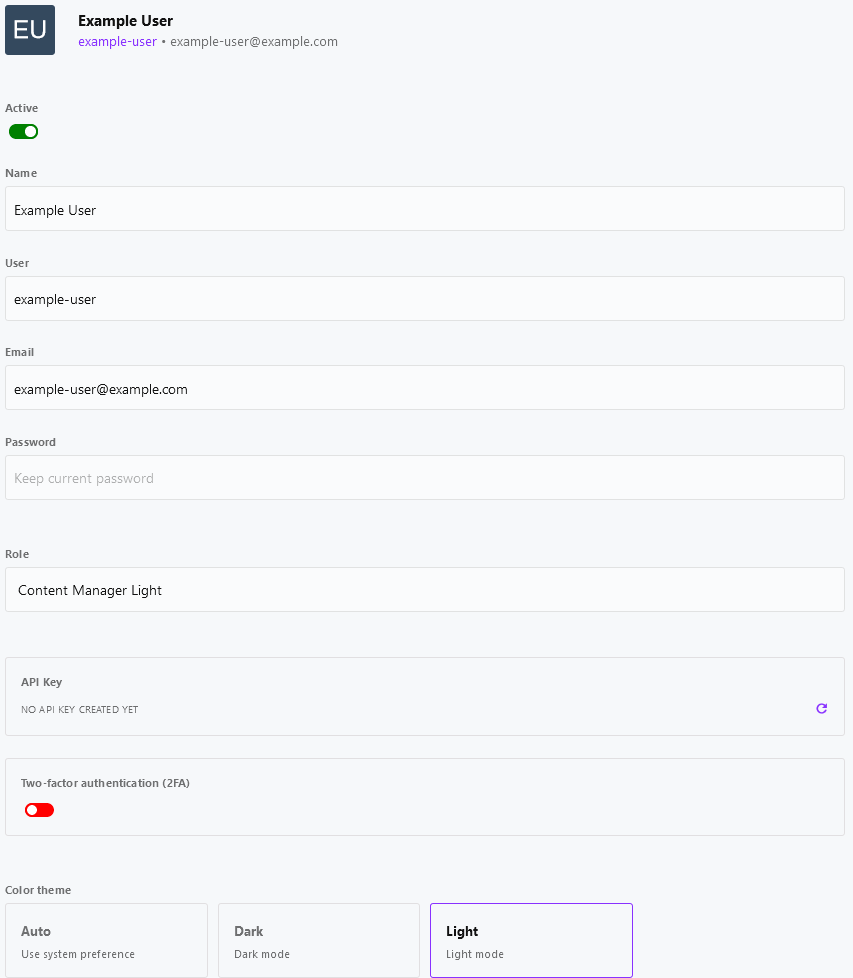

# Users

[[toc]]

## Introduction

Cockpit's user system is basically role based. Each user is assigned to a [Role](/concepts/roles-permissions/), that defines the user's [permissions](/concepts/roles-permissions/).

As a cockpit user you can

* log in to the administration panel
* request [API](/api/endpoints/) endpoints

with access to endpoints, features and resources you got permission to.

## Managing users

### The basics

1. Login to your Cockpit installation
2. Navigate to *Users* at **/system/users**
3. See the list of users
4. Possible actions
* Click *Add user* to add a new user
* Click on a user item to edit the user
* Delete a user

### User settings explained

As most fields are well-known from other web applications or cms systems not much has to be said here. Nevertheless, we want to point out some things.

* The [Role](/concepts/roles-permissions/) is essential when dealing with lots of users with different permissions required, so make sure to set appropriately in any case.
* The API Key provides access to Cockpit's API.

## Further reading

* Detailed information about roles and permissions in Cockpit can be found at [Roles & Permissions](/concepts/roles-permissions/).
* More information on API key usage is available at [API](/api/authentication/).